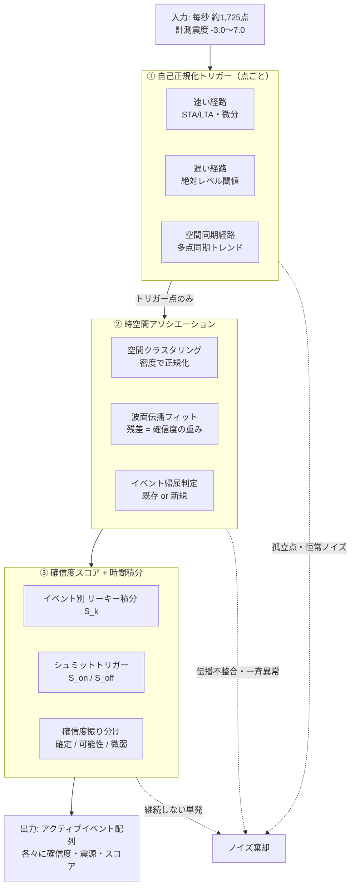
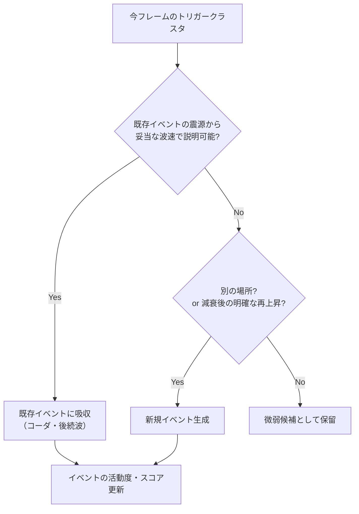
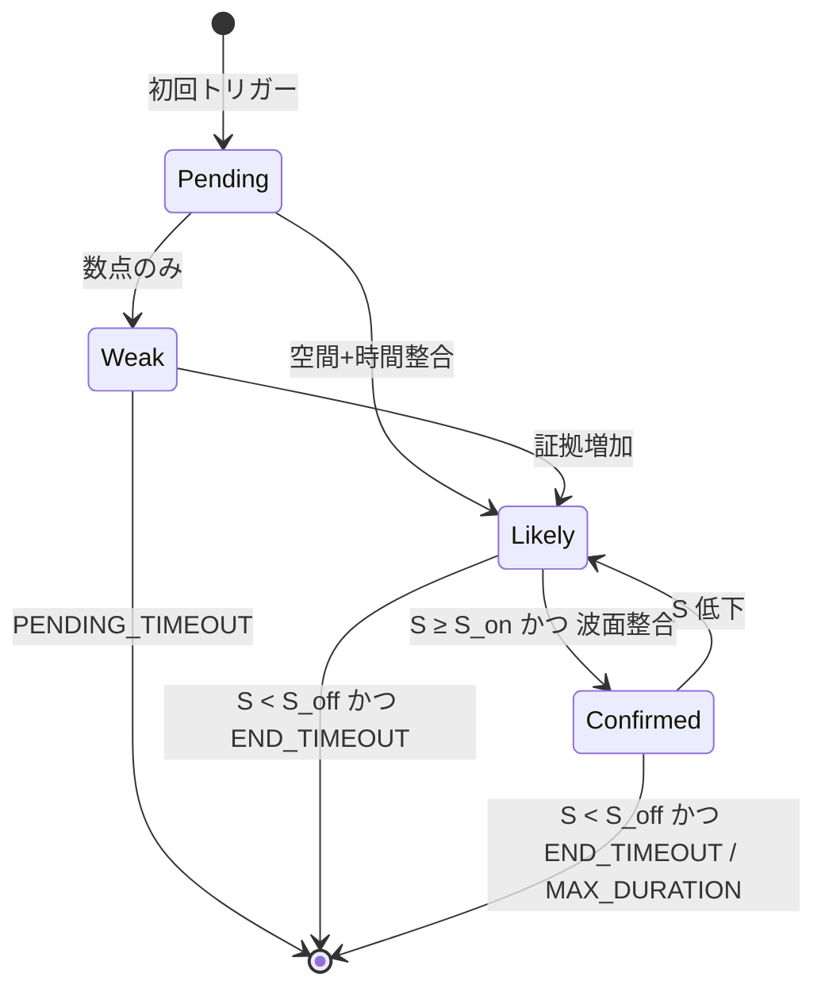
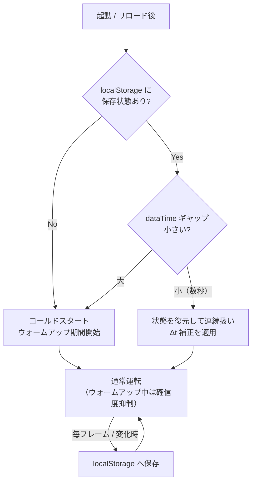

# 強震モニタ地震検知エンジン 設計書

> ⚠️ **本文書は歴史資料**（当時 V2 として実装された後、V3 設計に置換済み）。
> **現行仕様は [`kyoshin-detection-spec.md`](kyoshin-detection-spec.md)、V3 の設計判断・調査履歴は
> [`kyoshin-detection-v3-design.md`](kyoshin-detection-v3-design.md) を参照**。

**対象**: Yahoo リアルタイム震度（強震モニタ）ストリームからの地震検知ロジック
**ステータス**: 歴史資料（当時は「設計確定（実装未着手）」だったが、後に V3 設計に置換）
**前提バリアント**: standard / DMDSS 両方（`useKyoshinRealtime` は常時 `enabled=true`）

---

## 1. 目的とスコープ

### 目的

1 秒ごとに更新される観測点別リアルタイム震度（強震モニタ）から地震を検知する。

- **弱い地震も拾う**（感度）— 目標は**震度 1 未満（機器検知レベル）**の立ち上がりまで。
- **ノイズ・誤検知を減らす**（特異度）— 単発スパイク・局所ノイズ・恒常ノイズ源を排除する。
- **余震・多重地震・ゆっくり地震**に耐える。

### 非目標（対象外と割り切る領域）

| 対象外 | 理由 |
|---|---|
| 測地的スロー地震（スロースリップ・超低周波） | 地動の高周波エンベロープに乗らず、強震モニタでは観測不能 |
| 厳密な多重震源分離・震源決定 | EEW・一元化処理の領分。本エンジンは「揺れの検知と確信度」に徹する |
| 緩やか × 弱い × 少数点（遠地の極微小地震） | S/N 的に原理限界。拾えるふりをしない |

---

## 2. 設計思想（核心）

> **単一しきい値では「弱い地震を拾う」と「誤検知を減らす」は必ずトレードオフになる。**
> 証拠の次元を **空間相関・時間継続・伝播整合** へ増やし、弱い証拠を束ねて判定することで、感度と特異度を同時に押し上げる。

ROC 曲線でいえば、単一しきい値の運用点は 1 本の曲線上を上下するだけ（上げれば見逃し、下げれば誤報）。独立な軸を足すと**曲線そのものが左上へ移動**し、同時改善が可能になる。

もう一つの柱が **確信度つきの三段出力**。震度 1 未満を二値（検知した / しない）で判定すると必ず破綻するため、確信度で表現する。

| 確信度 | 成立条件のイメージ | 通知の扱い |
|---|---|---|
| **確定** (`confirmed`) | 多点 + 波面整合 + 時間継続あり | 通常発報（音・自動タブ切替） |
| **可能性** (`likely`) | 少点だが空間 + 時間整合 | 弱表示・音は控えめ |
| **微弱** (`weak`) | 数点の立ち上がりのみ | 参考表示（音なし・目立たせない） |

---

## 3. 入力データの特性と制約

### 3.1 データ形状

| 項目 | 内容 | 出典 |
|---|---|---|
| 取得元 | `fetchRealtimeIntensity(target)` | `src/services/kyoshin.ts:172` |
| ポーリング | 1 秒ごと（`POLL_MS = 1000`） | `src/hooks/useKyoshinRealtime.ts:29` |
| 観測点数 | 約 1,725 点 | `src/components/Map/KyoshinPoints.tsx:17` |
| 観測点座標 | `SiteCoords = [lat, lng][]`（**ID 無し**） | `src/services/kyoshin.ts:12` |
| 震度値 | `indices: number[]`（整数 0〜20、`intensity` 文字列を `charCodeAt - 100`） | `src/services/kyoshin.ts:190` |

### 3.2 値のスケール

```
計測震度 value = -3.0 + index * 0.5        （src/utils/kyoshinIntensity.ts:19-21）
  index  0  → value -3.0
  index  6  → value  0.0  （震度 0）
  index  7  → value  0.5  （震度 1 相当の下端）
  index 20  → value  7.0  （震度 7）
```

**震度階級ではなく、0.5 刻みの連続的な計測震度をインデックス化した値**である点に注意。

### 3.3 設計に効く制約（重要）

1. **観測点の同一性が配列インデックス依存** — 観測点 ID が無く、`SiteCoords[]` の位置が `indices[]` と対応する。`siteConfigId` が変わると sitelist ごと差し替わる（`useKyoshinRealtime.ts:94`）。→ **点ごとの状態は座標をキーに管理する**（後述 §7）。
2. **フレーム欠損・時刻不連続** — CDN 遅延で欠損コマはスキップされる。リアルタイム↔リセット、リプレイ開始/停止で時刻がジャンプする。→ **壁時計ではなく `dataTime`（データ時刻）で駆動し、Δt で時定数を補正する**。
3. **強震モニタ値は既に平滑化済み** — 生の地動ではなく時間窓平滑された実効値。オンセットは元々なまっているため、微分ベースの検出は分解能に限界がある。
4. **毎日 5:00 の自動リロード** — 状態が全消去される（§7.3 で対処）。
5. **欠測観測点** — 欠測を「揺れ 0」と誤解しないよう、欠測フラグを状態更新から除外する。

---

## 4. アーキテクチャ全体像



**設計の要点**: 重い計算（クラスタリング・波面フィット）は**トリガーが出たときだけ**走る。平常時のトリガーはほぼゼロなので、常時コストは点ごと EWMA 更新の O(N) のみ。

---

## 5. 各段の詳細仕様

### ① 自己正規化トリガー（点ごと・逐次）

観測点ごとに EWMA を維持し、**絶対震度ではなく「その点にとっての普段からの逸脱」**を見る。恒常的に揺れる点は基準（LTA）が上がって自動的に鈍り、静穏な点は微小な立ち上がりでも拾える。

```
STA ← α_s·x + (1−α_s)·STA      # 短時間平均（時定数 ~2秒）
LTA ← α_l·x + (1−α_l)·LTA      # 長時間平均（時定数 ~45秒）
σ   ← α_l·|x − LTA| + (1−α_l)·σ  # ばらつき（EWMA）
```

Δt が飛んだフレームでは係数 `α` を経過時間で補正する（`α_eff = 1 − exp(−Δt/τ)`）。

> **実装上の単位の扱い（refinement）**: 強震モニタの値は計測震度（≒ 地動振幅の**対数**、-3.0〜7.0）である。
> そのため速い経路は STA/LTA の「比」ではなく「**差 (STA − LTA)**」で判定する。差はそのまま線形振幅の対数比に相当し、
> オフセットを持つ値の比より物理的に正しい。コアは全体を value（計測震度）単位で扱い、境界で index → value 変換する。

#### トリガーは 3 経路の OR

急・緩、強・弱のどの象限も取りこぼさないため、性質の違う判定を並列に持つ。

| | 急な立ち上がり | 緩やかな上昇 |
|---|---|---|
| **弱い** | **速い経路**：`STA − LTA ≥ DELTA_TRIG` または `x ≥ LTA + max(k·σ, SIGMA_FLOOR_MARGIN)` | **空間同期経路**：単点では弱いが、近接多数点が同期して同方向にトレンド（§②で判定） |
| **強い** | 速い経路 | **遅い経路**：`x ≥ ABS_LEVEL`（立ち上がりの急峻さを問わない） |

> `SIGMA_FLOOR_MARGIN` は σ→0（完全静穏点）が微小変動で誤発火するのを防ぐ下限マージン。`k·σ` が小さくても最低限の絶対マージンを要求する。

- **速い経路** — 急オンセット。震度 1 未満の弱い地震もここで拾う。
- **遅い経路** — 絶対レベル。ゆっくり成長する遠地・深発・巨大地震を取りこぼさない。
- **空間同期経路** — 単点 STA/LTA が鈍くても、多点が同期して緩やかに上がる相関を②で拾う。局所ドリフト・ノイズは同期しない。

#### 2 つの落とし穴への手当て

- **LTA 汚染の防止（余震マスキング対策）** — トリガー発火中は LTA / σ の更新を**凍結**する。凍結しないと強い揺れで基準が持ち上がり、後続・余震を取りこぼす。
- **second onset（コーダ中の余震）** — 揺れ継続中の新地震は、レベルは高止まりでも包絡線が**減衰から上昇へ転じる**。この「傾き符号の反転 + 増分」を新オンセット条件に加える。

```
揺れの強さ
  │        本震
  │        ╱╲              余震（second onset）
  │       ╱  ╲___         ╱╲
  │      ╱      ╲___  ╱‾    ╲___
  │  ___╱           ╲╱          ╲____
  │─────●──────────────●────────────────  ← レベル閾値だけだと
  │  静穏 ↑onset      ↑再上昇を検出         この区間が1本に融合
  └──────────────────────────────────▶ 時間
```

---

### ② 時空間アソシエーション

トリガー点だけを集めて処理する。

#### 空間クラスタリング（密度正規化）

観測点密度は都市部（密）と山間部・離島（疎）で大きく異なる。固定 km・固定点数の閾値は地域で意味が変わるため、**「近傍 k 点のうち何割がトリガーしたか」**で正規化する（または半径・最小点数を局所密度でスケール）。近傍探索は事前構築したグリッド索引で O(トリガー点数) に抑える。

> **⚠ 検証で判明した限界（Phase 2 → Phase 3 で是正）**: 単純な単一連結（single-linkage / union-find, `PROXIMITY_KM`）でクラスタ化すると、**広域で揺れる実地震では felt エリア全体が数珠つなぎに 1 つの巨大クラスタへ融合**する（福島県沖 M4.2 のリプレイで size 233 の非整合ブロブを観測）。巨大クラスタは単一波面に乗らず fit 不成立 → weak 止まりになり、確信度・震央推定が機能しない。
> **Phase 3 の是正方針**: クラスタ**直径の上限**を設ける／波面整合（残差）による**サブクラスタ分割**／最早オンセット点を核とした**シード成長**型クラスタリングへ移行する。single-linkage を素で使わない。

#### 波面伝播フィット

トリガー点の `(lat, lng, t_trigger)` から震源候補をグリッドサーチする。

```
各候補震源 (x0, y0) について:
    r_i = haversine((x0,y0), 点_i)
    t_i ≈ t0 + r_i / v      を最小二乗で (t0, v) フィット
    残差 RMS を評価
→ 残差最小の候補を採用（見かけ速度 v は 2.5〜4.5 km/s に拘束）
```

- 地震なら「遠い点ほど遅れて立ち上がる」ため残差が小さい。ノイズは乗らない。
- **3 点以上でフィット可能。2 点以下では波面フィットせず**、空間近接 + 時間継続のみで「微弱」候補に格下げ（少数点で震源を過剰決定しない）。
- 深さ無視の平面近似・単一見かけ速度は深発/近地で合わないため、**残差はゲートではなく確信度の重み**に使う。
- **一斉異常の排除** — データ欠損・時刻ずれ・観測網一括補正で全点が同時に跳ねるケースは `v→∞`（残差ゼロだが距離無相関）として専用チェックで弾く。

波面整合の直感（距離–トリガー時刻プロット）:

```
 t_trigger                          t_trigger
   │        ● 地震                     │   ●        ● ノイズ
   │      ●   （直線に乗る）            │      ●  ●
   │    ●                              │  ●      ●   （散らばる）
   │  ●                                │     ●  ●
   └────────────▶ 震源からの距離        └────────────▶ 震源からの距離
```

#### イベント帰属判定



これにより、空間的に離れた同時多発地震は**別イベントに分離**、同震源の余震は**再上昇で新イベント化**できる。

---

### ③ 確信度スコア + 時間積分

イベントごとに独立した積分器を持つ。**グローバル単一状態にしない**ことが多重イベント分離の肝。

```
s   = 規模(√size) · 振幅(peak) · 波面残差の良さ · 空間連続性        # 今フレームの地震らしさ（frameScore）
S_k ← max(0, decay · S_k + s)                              # イベント k のリーキー積分
```

- **シュミットトリガー**: `S_k ≥ S_on` で発報、`S_k < S_off`（`S_off < S_on`）まで維持。
- 弱い地震は小さな `s` の継続で `S_on` に到達。単発スパイクは積分に残らず消える。
- 確信度は `S_k` の水準・波面残差・点数で振り分ける（§2 の表）。
- **終了判定**: `S_k < S_off` かつ無オンセットが `END_TIMEOUT` 継続でイベント終了。ただし余震活動で延々アクティブにならないよう `MAX_EVENT_DURATION` の上限を設ける。

---

### 地域類型別の扱い（観測網の地理と環境）

②の空間ロジックは「観測点が震源の周囲に連続して存在する」ことを暗黙に仮定する。この前提は地域で崩れるため、**観測網の幾何（密度・方位カバレッジ）とノイズ環境**の 2 軸で類型化し、個別に扱う。

事前に station 座標から各観測点へ**静的メタ**を付与する（`scripts/build-geo-blocks.mjs` で生成）:

- `blockId` — 所属地理ブロック（島・地域。海のギャップ `SEA_GAP_KM` で分断）
- `isNetworkInterior` — 観測網の内側か（周囲の方位カバレッジが十分か）
- `noiseEnv` — ノイズ環境（`urban` / `volcanic` / `quiet` / `coastal`。平常 σ から推定可）

#### A. 疎地域・離島・孤立点

対象: 沖縄・奄美・**小笠原・伊豆諸島**・対馬・隠岐・佐渡 など。

問題（§5② の密度正規化が効ききらない）:

1. 島内で最小点数を満たせない
2. 「近傍 k 点」が海を越え、遠すぎて時間同期しない
3. 島内密集で距離レンジ不足 → 波面フィットが縮退
4. 1〜2 点の孤立点は空間相関そのものが使えない

対処:

| 施策 | 内容 |
|---|---|
| ブロック内近傍限定 | 近傍を同一 `blockId` 内に限定し、海を越えさせない |
| ブロック内割合判定 | 絶対点数でなく「ブロックで到達可能な点数に対する割合」で成立判定 |
| 距離レンジチェック | ばらつきが閾値未満なら波面フィットを諦め、時間同期＋絶対レベルへ切替 |
| 孤立点は単点判定 | 明確なオンセット＋時間継続＋絶対レベルで拾うが確信度は「可能性」上限。静穏さと `noiseWeight` で誤報抑制 |
| 確信度上限 | 空間・波面の裏取りが薄い地域は原則「確定」に上げない |

**小笠原・伊豆諸島**は本土から遠く周囲の観測点が皆無に近く、深発地震（小笠原西方沖など）も多い。実質、単点〜島内少数点＋絶対レベルでの「可能性」判定になる。

#### B. 海域・海溝型（震源が観測網の外・片側配置）

対象: 三陸沖・日本海溝・南海トラフ・千島海溝・日向灘 など。震源が海側、観測点は陸側のみ。

- 波面フィットの幾何が**片側配置（azimuthal gap 大）**になり、**沖合方向の距離が縮退**して決まりにくい。
- **重要な区別**: これは「検知できるか」ではなく「**震源位置の精度**」の問題。陸側で多点が揃うため**検知自体は確定できる**。
- 対処: 震源を「点」でなく**方位＋最短距離＋不確実性**として持つ（震央マーカーは沖合方向に誤差を許す）。点数で確信度は担保されるので下げない。

> **✅ 実装済み（Phase 3-2, 2026-07-23）**: `estimateWaveFit` に2系統のフィットを併用する。
> - **radial フィット**（従来）: 最早オンセット点＝震央アンカーからの距離と走時の1D回帰。観測点が震源を囲む内陸浅発で有効。
> - **平面波スローネスフィット**（新規）: 局所平面(ENU)で `t ≈ t0 + px·E + py·N` を線形最小二乗。スローネスベクトル `(px,py)` の逆向きが**震源方位**（`bearingDeg`）、大きさの逆数が見かけ速度。片側配置で radial が壊れても方位は堅牢に決まる。
> - **片側判定**: アンカーから見たクラスタ点の**最大方位ギャップ** ≥ `ONE_SIDED_GAP_DEG`(160°) で `oneSided=true`。
> - **確信度の非対称ゲート**: `confirmed` に上げる最小点数を、radial 裏取りありは `MIN_CONFIRM_SIZE`(4)、片側配置（平面波のみ）は `MIN_CONFIRM_SIZE_ONESIDED`(8) と非対称にする。本物の海溝型は陸側で多数点が並ぶので確定でき、少数点のノイズ塊の偶然フィットは弾ける。
> - **距離のグリッド探索は採らない**: 強震モニタのオンセットは**1秒量子化**で、沖合距離を決める波面曲率（二次の微小効果）が埋もれるため、片側配置ではグリッド探索でも radial 方向が不安定（速度 prior も要る）。方位は一次効果として残るので、**方位＋最短距離＋不確実性**で正直に持つ設計を選んだ。

#### C. 遠地・観測網外（海外・遠地地震）

対象: 台湾・千島列島・ロシア沿海州 など、観測網の完全な外の大地震。

- 全国が緩やかに、ほぼ**平面波**（波面が平行）で揺れる。見かけ速度が実体波速度域を超える、または全国がほぼ一様に同期する。
- 対処: 震源決定を試みず、**「広域の揺れ（遠地地震の可能性）」の単一イベント**として束ねる。国内の同時多発と誤って分裂させないよう、平面波パターン（方位一定・見かけ速度過大・全国同期）を専用判定する。
- §5① の「遅い経路」「空間同期経路」と連動（ゆっくり成長する遠地地震はここで拾う）。

#### D. 高ノイズ地域

ノイズ対策は多層で考える。**散在する地域性ノイズの主判別は空間連続性ゲート**（地域非依存。下記）で、環境別に **① 自己正規化 / `noiseWeight` 故障観測点ガード / LTA・σ 追随** が補助する。

- **空間連続性ゲート（地域非依存の主判別・最重要）**: 本物の地震は感じた区域を**連続して**埋めるが、地域性ノイズ（散在する多点の一過性反応。例: 北関東の間欠ノイズ）は**間が抜けてスカスカ**になる。各メンバーの近傍 `CONTIG_RADIUS_KM`(25km) 内で「一緒に反応した割合」を測り、その中央値が `CONTIG_MIN`(0.4) 未満なら `confirmed`/`likely` に上げない（`weak` 止まり）。**地域を名指しで抑制しない**ため、関東の小地震の感度を落とさずに散在ノイズだけを弾ける。疎地域は §5-A のガードで免除（`CONTIG_DENSITY_RADIUS_KM`(50km) 内が `CONTIG_SPARSE_MIN`(15) 点未満なら連続性を問わない）。実データ検証: 実地震(福岡0.50 / 長野0.545 / 埼玉0.56) と 北関東ノイズ(≤0.30) が 0.30〜0.50 で明確に分離した。
- **大都市圏**（関東・関西・中京）: 密だが交通・工業ノイズで σ 床が高く昼夜変動も大きい。①の自己正規化が主役（各点が時間帯相応のベースラインから測るため固定閾値より頑健）。
- **単一観測点の故障・点的な火山性微動**（阿蘇・桜島・箱根 等）: 1 点が鳴り続ける故障（stuck/暴走センサ）や動かない点での火山性微動は、`noiseWeight`（トリガー稼働率の長時定数 EWMA）でクラスタリング前に落とす**補助ガード**。既定では duty ~42.5% 以上（ほぼ鳴りっぱなし）で除外する。連続性ゲートはクラスタ後に tier を決めるだけで、本物のクラスタに紛れ込んだ故障点の幾何汚染（震央・オンセット・波面フィットのずれ）は除けないため、この前処理が併存する。**震源が動かない群発**は通常の単発イベントと区別する（頻発時は通知抑制）。
- **季節性**（日本海側の冬の風・波浪・積雪）: 平常 σ が季節変動する。LTA/σ の追随で吸収するが、急な悪天候の立ち上がりには追随ラグが出うる。

### イベント併合（分裂統合）§5-E

1 つの地震が複数の `DetectionEvent` に分裂する問題への対処。② アソシエーションは `updated` 集合により 1 イベント=1 クラスタ/フレームに制限され、帰属を震央近接だけに頼ると (a) 1 フレームで複数クラスタに割れる、(b) 震央がフレーム間でジッタする、(c) 波面フィット失敗（`epicenter=null`）で再帰属できない、の 3 経路で同一地震が別 ID に割れる。分裂すると積分スコアが分散し、本来 `confirmed` に達する規模の地震を取りこぼす。

対処は 2 段:
- **帰属にメンバー観測点の重複を併用（②）**: クラスタとイベントの重複率 = |共通メンバ| / min(|クラスタ|, |イベント|) が `MERGE_MEMBER_FRAC`(0.34) 以上なら、震央が null／ジッタでも同一イベントへ再帰属する。
- **フレーム末の併合パス `mergeEvents`**: 重複率 ≥ `MERGE_MEMBER_FRAC`、または両者の震央が `PENDING_MATCH_KM`(120km) 以内のイベント対を 1 本化する。基準は発生時刻が早い方、スコアは max（同一エネルギーの二重計上を避ける保守側）、メンバーは和集合、震央・波面フィット系はフィット根拠が強い方（radial > 平面波 > フィット無し）から採用し、確信度を再評価する。

空間的に離れた別々の地震（メンバー素・震央 100km 超）は重複率 0・震央遠で併合されないため、同時多発は正しく分離される。実データ検証は §10.8。

---

## 6. 状態遷移（イベント単位）



---

## 7. 状態設計・永続化

### 7.1 純粋コアの型（TypeScript）

検知ロジックは React から切り離した**純粋関数**として実装する。副作用・`Date.now()` 直接参照を持たず、時刻は引数で注入する（決定的でテスト可能にするため）。

```ts
// src/utils/kyoshinDetector.ts（新規）

/** 1 観測点の逐次状態。キーは座標（"lat,lng"）で管理する。 */
interface SiteState {
  sta: number          // 短時間平均
  lta: number          // 長時間平均（トリガー中は凍結）
  sigma: number        // ばらつき（EWMA）
  frozen: boolean      // LTA 凍結中か
  lastValue: number    // 前フレーム値（微分・再上昇検出用）
  triggeredAt: number | null  // 最後にトリガーした dataTime(ms)
  triggerRate: number  // トリガー稼働率(duty)の EWMA。鳴りっぱなしの故障観測点の識別に使う
  noiseWeight: number  // 故障観測点ガードの減衰重み（0〜1。補助。散在ノイズの主判別は連続性ゲート）
}

/** 検知イベント（多重地震・余震を同時に保持できる）。 */
interface DetectionEvent {
  id: string
  epicenter: [number, number] | null  // 波面フィット由来。少数点では null。片側配置では最短距離の点
  bearingDeg: number | null            // 震源方位（真北0°時計回り）。平面波フィット由来。type-B で沖側を指す
  oneSided: boolean                    // 片側配置（type-B）。true なら沖合距離は不確実
  originTimeMs: number
  score: number                        // リーキー積分値 S_k
  confidence: 'confirmed' | 'likely' | 'weak'
  lastOnsetAtMs: number
  memberKeys: string[]                 // 参加観測点の座標キー
}

/** 検知エンジンの全状態。localStorage に永続化する対象。 */
interface DetectorState {
  sites: Record<string, SiteState>     // 座標キー → 逐次状態
  events: DetectionEvent[]             // アクティブイベント集合
  lastDataTimeMs: number               // 連続性チェック用
  warmupUntilMs: number                // ウォームアップ完了時刻
}

/** 事前計算する静的な観測点メタ（座標キー → メタ）。検知中は不変で永続化不要。 */
interface StationMeta {
  blockId: string                      // 地理ブロック（島・地域。海で分断）
  isNetworkInterior: boolean           // 観測網の内側か（方位カバレッジ十分か）
  noiseEnv: 'urban' | 'volcanic' | 'quiet' | 'coastal'
}

/** 1 フレーム分の入力。 */
interface Frame {
  dataTimeMs: number
  sites: [number, number][]            // SiteCoords（座標の順序 = values の順序）
  values: number[]                     // indices（= 計測震度インデックス）
  missing?: boolean[]                  // 欠測フラグ（あれば）
}

/** 純粋な状態遷移関数。1 秒ごとに呼ぶ。 */
function step(
  state: DetectorState,
  frame: Frame,
  meta: Record<string, StationMeta>,   // 座標キー → 静的メタ（不変）
): {
  state: DetectorState
  detections: DetectionEvent[]         // 今フレームのアクティブイベント（0 個以上）
}
```

React 側（`useKyoshinDetection` の置き換え）は毎フレーム `step` を呼ぶだけの薄いラッパーにする。

### 7.2 座標キー管理と sitelist 切替

- 状態は**配列インデックスではなく座標キー**（`"lat,lng"` を丸めた文字列）で保持する。
- `siteConfigId` 変化で sitelist が差し替わっても、座標キーで再マッピングすれば状態が別観測点に引き継がれる誤爆を防げる。新規座標は初期化、消えた座標は破棄。

### 7.3 リロード・欠損への耐性（永続化）

**方針: リロードを止めることに頼らず、状態がリロードを生き延びる。**



- 点ごと EWMA + アクティブイベントを座標キーで `localStorage` に保存。スカラ数個 × 1,725 点なので軽量。
- リロードは数秒で終わるため、`dataTime` ギャップが小さければ**連続として状態を活かす**（§3.3-2 の Δt 補正がそのまま効く）。大きく飛べばリセット。
- **既存の 5:00 リロードガード拡張（保険）** — 現状のカウントダウンは `title.alertTitle` が非 null の間だけ停止する（対象はウィンドウタイトルに出る情報全般。詳細は [`settings-pwa-spec.md`](settings-pwa-spec.md) §5）。ここに**確信度「確定」のイベント中は遅延**を一本足す。ただし余震で永久先送りにならないよう最大遅延を設ける。永続化が主役なので、これは保険の位置づけ。

### 7.4 ウォームアップ

- LTA 収束には数十秒かかる。起動直後・コールドスタート後の一定期間は確信度を抑制する（`weak` 上限など）。
- **揺れの最中の起動**では LTA が高値初期化され進行中地震を平常と誤学習するため、ウォームアップ中の判定は参考値扱い。

---

## 8. 懸念事項と対処（棚卸し）

| # | 懸念 | 対処 | 反映先 |
|---|---|---|---|
| 1 | 観測点同一性がインデックス依存・sitelist 切替 | 座標キーで状態管理・再マッピング | §7.2 |
| 2 | フレーム欠損・時刻不連続で時定数が狂う | `dataTime` 駆動 + Δt で α 補正 | §5①, §3.3 |
| 3 | ウォームアップ / 揺れの最中の起動 | ウォームアップ期間の確信度抑制・地震前から再生 | §7.4, §9 |
| 4 | 大地震時の計算量スパイク | トリガー点間引き・グリッド解像度段階化 | §4, §5② |
| 5 | 観測点密度・観測網の地理的偏り | 地域類型別の扱い（疎地域・離島／海域片側配置／遠地平面波／高ノイズ）。空間が薄い地域は時間軸＋確信度で補う | §5 地域類型 |
| 6 | 波面フィットの平面・単一速度近似 | 残差はゲートでなく確信度の重み | §5② |
| 7 | 既存 EEW との二重通知 | EEW がある地震は抑制・補完。強震検知は「EEW が出ない弱い地震」担当 | §10 |
| 8 | 確信度と通知頻度（オオカミ少年化） | 確信度ごとに通知強度を分離。微弱は音なし | §2 |
| 9 | 検知の終了判定・余震で延々アクティブ | `S_off` + `END_TIMEOUT` + `MAX_EVENT_DURATION` 上限 | §5③ |

---

## 9. パラメータ初期値（実データで要調整）

> 合成テストデータでは追い込めない。§10 のリプレイ検証で ROC 的に詰めること。

| 定数 | 初期値 | 意味 |
|---|---|---|
| `STA_TAU` | 2 s | 短時間平均の時定数 |
| `LTA_TAU` | 45 s | 長時間平均の時定数 |
| `DELTA_TRIG` | 1.0（value） | 速い経路：`STA − LTA` の発火閾値（対数振幅比。旧 R_TRIG） |
| `K_SIGMA` | 4.0 | `LTA + k·σ` の係数 |
| `SIGMA_FLOOR_MARGIN` | 0.75（value） | σ ベース発火の最小マージン（σ→0 での誤発火防止） |
| `ABS_LEVEL` | 0.5（value＝震度1） | 遅い経路の絶対レベル閾値 |
| `TRIG_FLOOR` | −1.5（value＝index 3） | 量子化ノイズ除去の絶対下限 |
| `RISE_DELTA` | 0.5（value） | 立ち上がり（second onset の素）判定の増分閾値 |
| `NEIGHBOR_K` | 8 | 密度正規化の近傍点数 |
| `TRIG_RATIO` | 0.4 | 近傍 k 点中のトリガー割合閾値 |
| `SEA_GAP_KM` | 40 km | 地理ブロック分割の海ギャップ閾値 |
| `BLOCK_MIN_RATIO` | 0.5 | 疎ブロック内でのトリガー割合成立閾値 |
| `FIT_RANGE_MIN_KM` | 15 km | 波面フィットに要する距離レンジ下限（縮退回避） |
| `PLANE_WAVE_V` | 8 km/s 超 | 平面波（遠地）とみなす見かけ速度上限 |
| `V_MIN / V_MAX` | 2.5 / 4.5 km/s | 見かけ速度の許容範囲 |
| `RESID_GOOD` | 2.0 s | 波面残差 RMS の「良好」目安 |
| `MIN_FIT_POINTS` | 3 | 波面フィット最小点数 |
| `DECAY` | 0.8 / frame | リーキー積分の減衰 |
| `S_ON / S_OFF` | 要調整 | シュミットトリガー上限 / 下限 |
| `PENDING_TIMEOUT` | 4 s | 候補の有効期限 |
| `END_TIMEOUT` | 10 s | 無オンセット継続での終了 |
| `MAX_EVENT_DURATION` | 300 s | イベント強制終了の上限 |
| `WARMUP` | 60 s | 起動後の確信度抑制期間 |
| `NOISE_BLACKLIST` | 300 s | 恒常ノイズ源の減衰持続 |

---

## 10. 検証戦略

### 10.1 リプレイによる実データ検証

既存のリプレイ機能をそのまま流用する（新規インフラ不要）。

- `timeOffset` を渡すと `initialTarget = now + timeOffset` から 1 秒刻みで再生する（`useKyoshinRealtime.ts:129-168`）。
- 過去の実地震の発生時刻に合わせれば、その時の `indices` が実データで流れてくる。
- **地震ちょうどではなく 1〜数分前から再生**して LTA をウォームアップさせること（§7.4）。

### 10.2 キャプチャ列による単体テスト

- 代表的な地震・ノイズの `indices` 列を JSON ダンプで固定化し、`step` の純粋関数性を利用して回帰テストにする。
- パラメータ変更のたびに見逃し・誤報の増減を即座に測れる（人力リプレイ目視だけでは追い込めない）。

### 10.3 評価軸

| 軸 | 見るもの |
|---|---|
| 感度 | 既知の弱い地震の検出可否・確信度 |
| 特異度 | 平常時（静穏・ラッシュ時・悪天候）の誤報率 |
| 遅延 | 発生から検知までの秒数 |
| 多重耐性 | 余震・同時多発地震の分離可否 |

### 10.4 新旧並走比較

App で新旧両エンジンに同じストリームを流し、リプレイしながらログで突き合わせて移行の安全性を確認する。

### 10.5 Phase 2 並走検証の結果（2026-07-23）

`useKyoshinDetectorV2` を並走（`window.__kyoshinV2` に公開）させ、DMDSS 版で実測した:

- **特異度（平常時）**: 初期実装は false `likely` 多数（〜11件）。① delta 経路のノイズ正規化と③ 確信度への伝播整合ゲート（fitOk 必須）を入れて false `likely` を 1 件程度・false `confirmed` 0 に低減。
- **感度（正のコントロール＝福島県沖 M4.2・震度2 のリプレイ）**: トリガーが急増し初動の coherent 波面を `likely`（震央推定 約110km 誤差）で捕捉。ただし **`confirmed` には未到達**、かつ伝播後に **single-linkage クラスタ融合で size 233 の weak ブロブ**に劣化（上記 §5② の限界）。震央は沖（type-B）でミスロケーション。
- **確信度ゲートの妥当性**: 非整合な巨大ブロブを `confirmed` に上げず `weak` に留めた（誤確定防止は機能）。

**結論**: ②③ はエンドツーエンドで動作。UI 表示駆動に載せる前に **Phase 3（single-linkage クラスタリングの是正・type-B 震央）** が必要。

### 10.6 Phase 3 検証の結果（2026-07-23）

**Phase 3-1 クラスタリング刷新**（時空間ゲート付きシード成長）: 正のコントロール **長野県中部 M3.2（内陸浅発）** リプレイで、震央推定 誤差 ~15km・coherent size~30（size233 ブロブ化せず）・`likely` 到達を確認。3点クラスタは高スコアでも `likely` 止まり（`MIN_CONFIRM_SIZE=4`）。

**Phase 3-2 type-B 震央（平面波方位）**: 正のコントロール **福島県沖 2026-07-22 20:11（真値 37.2N,141.6E＝沖=東・震度2）** をページ内で実モジュール `step()` によりリプレイ（発震70秒前からプリロールし LTA/σ 収束＋ウォームアップ通過）:

| 時刻 | conf | bearing | oneSided | size | radial |
|---|---|---|---|---|---|
| 20:11:48 | weak | null | true | 5 | false |
| 20:11:53 | likely | **83°** | true | 9 | false |
| 20:11:54 | **confirmed** | **83°** | true | 11 | false |
| 20:11:55〜 | confirmed | 79〜80° | false | 13〜20 | true |

- **方位が正しく東（沖側）を向く**（79〜104°、主に ~83〜92°）。真の震源 141.6E は沿岸アンカー ~140.6E の東。type-B の主目的（沖合方向の提示）が実データで機能。
- **`oneSided` は有意**: 沿岸のみの初期フェーズは true、内陸が埋まると false に遷移（「常に true」ではない）。
- **非対称ゲートが設計どおり**: size 11（≥`MIN_CONFIRM_SIZE_ONESIDED`）で片側配置のまま `confirmed` に到達（本物の海溝型なので確定してよい）。平常時・リプレイの size3 ノイズ塊は `likely` 止まり。
- **クラスタ融合なし**: peak size 35 まで coherent を維持（Phase 3-1 の効果継続）。
- 震央アンカーは沿岸点（真値から ~110km 内陸）だが、正しい東向き `bearingDeg` を付与して沖合の不確実性を表現（設計 §5-B の意図どおり）。

**残課題（type-B とは独立の既存チューニング）**: `frameScore` は密な少数点クラスタ（ノイズ）を大きな coherent 実地震より高く評価しうる（震度2 の実イベントが score~0.95 で `likely`、一方で size3 ノイズが score~1.5〜2.0）。`S_ON`/`frameScore` の残差・規模の重み付けは要調整（より多くのイベントで ROC 調整）。平常時の likely 帯にも size3 の定常ノイズが残る（感度とのトレードオフ）。→ **§10.7 で `frameScore` を再設計し解消**。

**結論**: type-B 方位推定・非対称確信度ゲートは実データで妥当に機能。残タスクだった `frameScore`/`S_ON` の調整は §10.7 で対処。地域類型（疎地域・遠地平面波 type-C）は継続課題。

### 10.7 frameScore 再設計の検証（2026-07-23）

§10.6 の残課題に対し `frameScore` を **規模(√size・頭打ちなし) · 振幅(peak) · 波面残差の良さ · 空間連続性の積**へ再設計。旧実装は size を 8 で頭打ちにし振幅を無視していたため、大規模・高震度の実地震が片側配置の高残差で `waveFactor` 下限（0.3）に潰れ `likely` 止まりだった（例: 大隅 M5.2 size108 震度3 が score~0.97）。ページ内で実モジュール `step()` をリプレイ（発震120秒前からプリロール）し校正・検証した:

**感度（実地震 → `confirmed` 到達）**

| イベント | 最大震度 | 旧 | 新 peakScore | 結果 |
|---|---|---|---|---|
| 大隅半島東方沖 M5.2（沖・疎） | 3 | likely | 3.49 | **confirmed**（size108・contig1.0） |
| 福島県沖 M4.2（沖/type-B） | 2 | confirmed | 2.87 | confirmed（size159） |
| 長野県中部 M3.2（内陸） | 2 | confirmed | 2.12 | confirmed（震央誤差~15km） |
| 愛知県西部 M3.0（内陸） | 1 | – | 1.82 | **confirmed**（size56） |
| 埼玉県北部 M2.0（内陸Kanto） | 1 | likely | 1.52 | **confirmed**（際どい） |
| 福岡県筑後 M2.4（内陸） | 1 | likely | 1.07 | likely（最弱・peakVal0.5） |

**特異度（平常窓 → `confirmed` = 0）**

| 窓（07-22 JST） | 旧 peak | 新 peak | confirmed | likely |
|---|---|---|---|---|
| 北関東 12:00 | 2.13 | 1.28 | 0 | 3 |
| 深夜 03:00 | 1.97 | 0.99 | 0 | 1 |
| 午後 14:30 | 2.97 | 1.21 | 0 | 0 |
| 夕方 18:00 | 2.0 | 1.03 | 0 | 1 |

- 実地震（peakScore ≥1.5）とノイズ（≤1.28）が `S_ON`=1.5 で分離。振幅・連続性因子により平常ノイズの score が 40〜60% 低下し、false `likely` も減少（例: 午後 4→0）。
- 最弱の震度1（福岡・peakVal0.5）のみ `likely` に残る（ノイズと振幅が被る下限。特異度優先で妥当）。
- **残る課題（confirmed 発火は阻害しない）**: 1つの地震が複数イベントIDに分裂する（大隅4・福島3）。sound 配線は任意の `confirmed` で発火するため影響しないが、UI のマーカー/カード重複は要整理（イベント帰属の統合＝別タスク）。→ §5-E / §10.8 で解消。

**結論**: `confirmed` は「震度1（強）〜震度3を拾い、検証した全平常窓で誤発火 0」の特異度に到達。音・自動タブ切替への配線が可能になった。次タスクはイベント分裂の統合と V1→V2 配線（フラグ裏・V1 フォールバック）。

---

### 10.8 イベント分裂の統合と V1→V2 移行（2026-07-23）

§10.7 の残課題（1 地震の複数 ID 分裂）を §5-E の帰属統合（メンバー重複帰属＋フレーム末併合 `mergeEvents`）で解消し、強震モニタ検知を V1（`useKyoshinDetection`・6層フィルタ）から V2 エンジンへ全面移行した（フラグ併存はせず V1 を撤去）。

- **分裂統合の検証**: 大隅半島東方沖 M5.2 震度3（07-17）をリプレイ fold（発震120秒前から360秒・warmup 明け後）。同時 `confirmed` の最大が **旧「4 分裂」→ 1 件**に統合され、146/360 フレームで `confirmed` を維持（size 61・メンバー89点・oneSided・震央 [32.6,131.7]＝九州陸側最寄り）。空間的に離れた別地震は重複率 0・震央遠で併合されず、同時多発は分離される。
- **配線**: 音・自動タブ切替・自動フィット・地図オーバーレイ・リアルタイムタブのカードを V2 検知イベントが駆動する（`deriveKyoshinView` で検知点・確信度へ変換）。`confirmed`=検知音＋タブ＋通知、`likely`=候補音＋タブ（早期反応）。自動フィットは**メンバー観測点**に対して行い、不確実な震央（深発・片側配置）へは飛ばない。
- **warmup の注意**: コールドスタート（ページ読込・データ欠落リセット）後 `WARMUP_MS`(60s) は `confirmed`→`likely` 降格。ライブ常時稼働なら影響は限定的。恒久対策は状態永続化（§7.3）。

---

## 11. 既存 EEW との統合

強震モニタ検知の存在価値は **「EEW が出ない弱い地震」と「体感の裏取り」**。

- EEW（DMDATA / P2P）が出ている地震は EEW を主役にし、強震検知は抑制・補完に回す。
- 調停は `useKyoshinAlerts` 側で行い、同一地震の二重カード・二重音を防ぐ。

---

## 12. 実装ステップ（推奨順）

1. **純粋コアの骨格** — `src/utils/kyoshinDetector.ts` に型（§7.1）と `step` の外形・パラメータ定数を定義。
2. **① トリガー** — 座標キー管理・EWMA・Δt 補正・多経路 OR・LTA 凍結・second onset。
3. **② アソシエーション** — 地理ブロック・観測点メタの事前生成 → グリッド索引・密度正規化クラスタ・波面フィット・イベント帰属・地域類型別の分岐（疎地域／海域片側／遠地平面波）。
4. **③ スコア + イベント管理** — リーキー積分・シュミットトリガー・確信度振り分け・終了判定。
5. **永続化** — localStorage 保存/復元・dataTime 連続性・5 時ガード拡張。
6. **React ラッパー** — `useKyoshinDetection` を `step` 呼び出しに置き換え、新旧並走。
7. **検証** — キャプチャ列の単体テスト整備 → リプレイで ROC 調整。
8. **通知統合** — `useKyoshinAlerts` で確信度別通知・EEW 調停。

---

## 付録: 関連ファイル

| ファイル | 役割 |
|---|---|
| `src/services/kyoshin.ts` | Yahoo API fetch（sitelist・realtime intensity） |
| `src/hooks/useKyoshinRealtime.ts` | 1 秒ポーリング・リプレイ制御 |
| `src/hooks/useKyoshinDetection.ts` | 現行検知パイプライン（置き換え対象） |
| `src/hooks/useKyoshinAlerts.ts` | 検知結果に応じた通知・タブ切替 |
| `src/utils/kyoshinIntensity.ts` | index → 計測震度 → JMA 震度変換 |
| `src/utils/geo.ts` | `haversineKm`（距離計算） |
| `src/utils/kyoshinDetector.ts` | **新規: 純粋コア** |
| `scripts/build-geo-blocks.mjs` | **新規: 地理ブロック・観測点メタの事前生成** |
